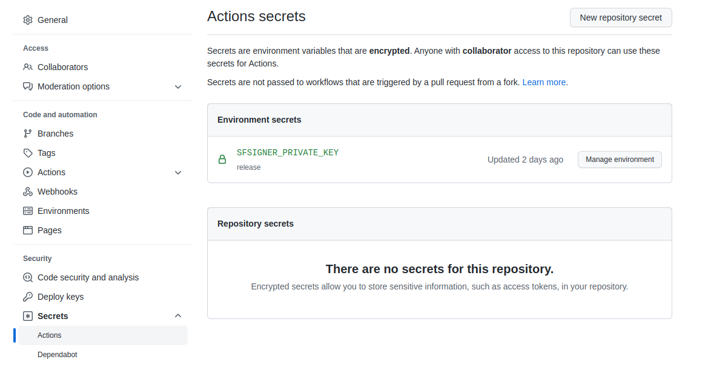
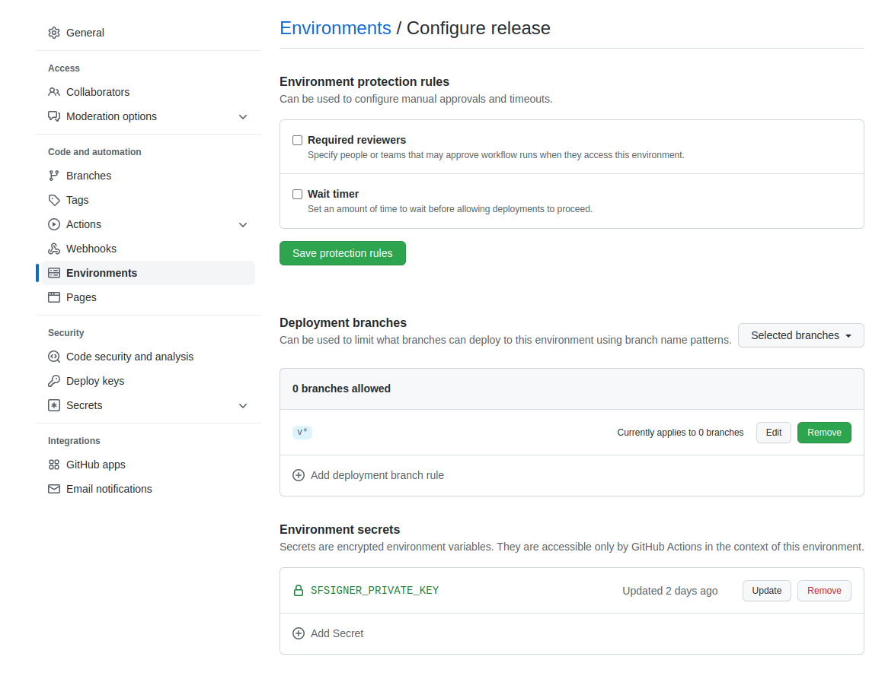

# How to sign a release artifact in GitHub Actions

1. Have your RSA private signing key and public key certificate created.
Please refer to [README.md](../README.md#how-to-use) for sample PKI
creating commands using `certstrap`. It's recommended that you only
write your private key material to a ramdisk during key generation.

   - On Linux (use `sudo` as needed)

     ```bash
     # mount point
     mkdir /mnt/ramdisk
     # 25MB should be sufficient for this purpose
     mount -t tmpfs -o size=25m tmpfs /mnt/ramdisk
     # Create key materials in /mnt/ramdisk
     # When you are done with the next step
     rm -rf /mnt/ramdisk
     umount /mnt/ramdisk
     ```

   - On macOS

     ```bash
     # ram://51200 == 25MB, should be sufficient
     diskutil erasevolume HFS+ 'ramdisk' `hdiutil attach -nobrowse -nomount ram://51200`
     # Create key materials in /Volumes/ramdisk
     # When you are done with the next step
     rm -rf /Volumes/ramdisk
     diskutil erasevolume HFS+ 'ramdisk' /Volumes/ramdisk
     diskutil eject /Volumes/ramdisk
     ```

   Say the private signing key and the associated certificate are
   `/mnt/ramdisk/sfsigner.key` and `/mnt/ramdisk/sfsigner.pem`, respectively.

2. In GitHub repository `Settings -> Security -> Secrets -> Actions`,
add a new repository secret or a environment secret with name as
`SFSIGNER_PRIVATE_KEY`, and value as the content of
`/mnt/ramdisk/sfsigner.key`. The figures below demonstrate an example of
an environment secret in the `release` environment.

   
   

   Add the certificate file `/mnt/ramdisk/sfsigner.pem` to your source
   repository, for example, to `data/certs/sfsigner.pem`, so it's
   available to the GitHub Actions runner.

   Once added as a GitHub Actions secret, the private signing key may be
   deleted, with the ramdisk destroyed.

3. To sign a release artifact in a GitHub Actions workflow, add the following step in your release job

   ```yaml
   - name: Sign artifact
     run: |
       cd ${{ github.workspace }}
       ARTIFACT_FILE=/path/to/artifact
       sfsigner sign "${ARTIFACT_FILE}" -c data/certs/sfsigner.pem -o "${ARTIFACT_FILE}.sig" 
     env:
       SFSIGNER_PRIVATE_KEY: ${{ secrets.SFSIGNER_PRIVATE_KEY }}
    ```

    Here, `sfsigner` is a prebuilt version of `sfsigner` available in
    the build environment, e.g., via
    [Hermit](https://github.com/cashapp/hermit).

    An example release workflow that does artifact signing can be found
    in
    [release.yml](https://github.com/syncom/sf-signer/blob/cc88ae04208e195a3a97441ce338e3d2b9413abb/.github/workflows/release.yml#L56-L66).
